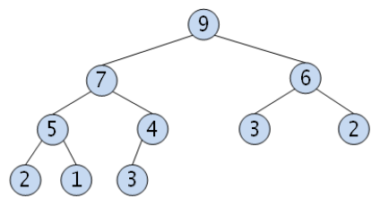

# 더 맵게 - Level2

## 1. 나의 풀이 (실패, 런타임 오류, 시간초과)
* 슈도코드(의사코드, pseudocode)
  * 1. 1번째로 작은값, 2번쨰로 작은 값을 찾는다.
  * 2. 스코빌 지수 공식에 대입 한다.
  * 3. b의 결과(1,2번째 작은값 제거 후 스코빌 지수 공식에 대입한 값 배치) + 나머지 배열 붙이기
  * 4. 1 ~ 3의 과정을 스코빌 지수가 K값이 될때까지 반복한다.
```
answer = 0;
            
arr = scoville[] 오름차순 정렬하여 대입

while(true) {
    if(arr.size < 2) {
      reutrn -1;
    }
    
    cal = arr[0] + (arr[1] * 2)
    if(car >= K) {
        answer++;
        break;
    } else {
        arr.delete(0);
        arr.delete(1);
        arr.add(0, cal);
        continue;
    }
}

return answer;
```
> 풀이 과정에 대한 생각은 맞았으나.. 우선순위큐에 대한 개념을 몰라 실패 함

* 소스코드 (테스트 케이스 통과 실패)
```java
int answer = 0;
List<Integer> list = new ArrayList<>();
for(int l : scoville) {
  list.add(l);
}

list.sort(Comparator.naturalOrder());

while(list.size() >= 2) {
  answer++;
  int cal = list.get(0) + (list.get(1) * 2);
  if(cal >= K) {
    break;
  } else {
    list.remove(0);
    list.remove(1);
    list.add(0, cal);
    list.sort(Comparator.naturalOrder());
    continue;
  }
}

if(list.size() < 2) {
  return -1;
} else {
  return answer;
}
```

<br/>

## 2. 재풀이(다른사람 코드 참고)
```java
int answer = 0;

PriorityQueue<Integer> q = new PriorityQueue<>();
for(int n : scoville) {
  q.add(n);
}

while(q.peek() < K) {
  if(q.size() < 2) {
    return -1;
  }

  answer++;
  q.add(q.poll() + (q.poll() * 2));
}

return answer;
```

> ### 개선사항
>> - 우선순위 큐 개념을 적용하여 재풀이
>> - 최소힙으로 데이터를 정렬하고 추출

<br/>

## 💡 알아야 할 개념 요약
### 📌 우선순위 큐(Priority Queue)와 힙(Heap) 📌

### 우선순위 큐(Priority Queue)
- 일반적인 [큐의 구조인 **FIFO(Firt-In-First-Out)**](https://github.com/soyoungkim9/programmers/blob/main/Stack/%EA%B0%99%EC%9D%80%20%EC%88%AB%EC%9E%90%EB%8A%94%20%EC%8B%AB%EC%96%B4.md#%ED%81%90queue)를 가지면 먼저 들어온 데이터가 아닌 **우선순위가 높은 데이터가 먼저 나가는 형태의 자료구조**
- 일반적으로 **힙(Heap)** 으로 구성된 이진트리구조로 되어 있다.

### 힙(Heap)
- 우선순위 큐를 위해 고안된 완전이진트리 형태의 자료구조 
- 여러 개의 값들 중 최댓값 및 최솟값 찾아내는 연산을 빠르게 하기 위한 자료구조

### 최소 힙(Min Heap)


- 부모노드 <= 자식노드 형태의 완전이진트리 구조
- 오름차순 정렬 시 이용

### 최대 힙(Max Heap)


- 부모노드 >= 자식노드 형태의 완전이진트리 구조
- 내림차순 정렬 시 이용

<br/>

## 💡TIP
- Java에서 PriorityQueue의 내부 요소는 힙으로 구성되어 이진트리 구조로 되어 있다.
- Java에서 PriorityQueue는 natural ordering(오름차순 정렬)이 기본값이며 Comparator 인터페이스로 우선순위 조건을 부여할 수 있다.
  * **낮은 숫자가 우선 순위인 경우 예시  : PriorityQueue<Integer> priorityQueueLowest = new PriorityQueue<>()** 
  * **높은 숫자가 우선 순위인 경우 예시  : PriorityQueue<Integer> priorityQueueHighest = new PriorityQueue<>(Collections.reverseOrder());**

<br/></br>

#### 참고
https://jie0025.tistory.com/287

https://suyeon96.tistory.com/31

https://velog.io/@gillog/Java-Priority-Queue%EC%9A%B0%EC%84%A0-%EC%88%9C%EC%9C%84-%ED%81%90