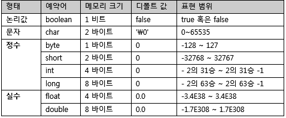
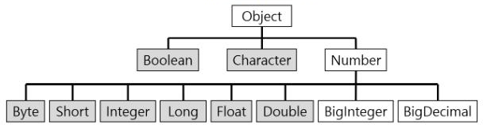

# 폰켓몬 - Level1

## 나의 풀이
* 슈도코드(의사코드, pseudocode)
    * 연속된 숫자 제거
    * 이전값과 현재값 같지 않을때 배열에 넣는다. 
```
int[] answer;
            
answer[0] = arr[0];
for(arr의 길이) {
    if(answer[answer.length-1] != arr[i]) {
        answer[j] = answer[i];
    }               
}

return answer;
```

* 소스코드
```java
List<Integer> list = new ArrayList<>();

list.add(arr[0]);
for(int i = 0; i < arr.length; i++) {
  if(list.get(list.size()-1) != arr[i]) {
    list.add(arr[i]);
  }
}

return list.stream().mapToInt(Integer::intValue).toArray();
```

<br/>

## 재풀이(다른사람 코드 참고)
```java
Stack<Integer> stack = new Stack<>();

for(Integer a : arr) {
  if(stack.empty() || stack.peek() != a) {
    stack.push(a);
  }
}

return stack.stream().mapToInt(i -> i).toArray();
```

<br/>

## 개선사항
- Stack 자료구조를 사용하여 맨 마지막값이 현재값과 일치하는지 검증
- primitive 유형으로 결과값 반환하기 위해 Stream API 사용
<br>(일일이 int[] 형 배열에 for문 돌려서 재할당 해도 되지만.. 그러기 싫었음 멋 없잖아 ㅎㅎ)
- 깔끔한 소스코드 작성을 위해 람다식(익명함수) 적용

<br/>

## 💡 알아야 할 개념 요약
### 📌 스택(STACK)과 큐(QUEUE)
### 스택(STACK)


### 스택의 특징
- 후입선출(LIFO, Last-In-First-Out) 구조 
- <mark>가장 마지막 삽입된 자료가 가장 먼저 삭제 됨</mark>
- 스택에서 top을 통해 한 곳으로 접근 가능하며 삽입하는 연산을 push, 삭제하는 연산을 pop 이라고 함 (top은 가장 최근에 들어온 자료를 가르킴)

### 스택의 활용 예시
- 웹 브라우저 방문기록(뒤로 가기)
- 실행 취소(undo)
- 역순 문자열 만들기

### 큐(QUEUE)


### 큐의 특징
- 선입선출(FIFO, First-In-First-Out) 구조
- **가장 먼저 삽입된 자료가 가장 먼저 삭제 됨**
- 큐는 rear와 front를 통해 양방향으로 접근 가능하며 삽입하는 연산을 enQueue, 삭제하는 연산을 deQueue 라고 함 (rear을 통해 들어오고 front를 통해 나감)

### 큐의 활용 예시
- 프로세스 관리
- 은행 업무
- 우선순위가 같은 작업 예약(프린터의 인쇄 대기열)
- 캐시(cache) 구현

<br/>

### 📌 기본형(Primitive Type)과 래퍼 클래스(Wrapper Class)
<figure>
  
  <figcaption style="text-align:center">Primitive Type</figcaption>
</figure>

<figure>
  
  <figcaption style="text-align:center">Wrapper Class</figcaption>
</figure>

### 기본형(Primitive Type)
- **논리형(boolean), 문자형(char), 정수형(byte, short, int, long), 실수형(float, double)의 8가지 기본 자료형**
- 비객체 타입으로 NULL을 가질 수 없으며 NULL을 가지고 싶으면 Wrapper Class를 활용 해야 함

### 래퍼클래스(Wrapper Class)
- **기본형 데이터(primitive type) 타입을 객체로 변환한 클래스**<br/>
ex) Boolean, Character, Byte, Short, Integer, Long, Float, Double

### 박싱(Boxing)과 언박싱(Un-Boxing)
- 박싱(Boxing) : primitive type(기본형 데이터 타입) -> wrapper class(래퍼 클래스)로 변환
- 언방식(Un-Boxing) : wrapper class(래퍼 클래스) -> primitive type(기본형 데이터 타입)으로 변환
- JDK 1.5 이상 부터는 autoBoxing, autoUnBoxing 기능 제공

### 참조형(Reference type)
- **primitive type을 제외한 모든 타입**
- **java.lang.Object 클래스를 상속한 모든 클래스**
  - 예시 : 클래스 타입(Class Type), 인터페이스 타입(Interface Type), 배열 타입(Array type), 열거 타입(Enum Type)

<br/>

### 📌 컬렉션(Collection)과 스트림(Stream) 
### 컬렉션(Collection)
- **List, Set, Map 과 같은 데이터의 집합**, 즉 자료구조
- 외부 반복 
  - 사용자가 직접 반복을 처리 해야 함 (for-each, while 등)
  - 병렬처리를 위해 멀티스레드 코드를 구현해야 함
- 모든 데이터를 메모리에 저장하는 자료구조 (컬렉션의 모든 요소는 컬렉션에 추가되기 전에 계산되어야 함)

### 스트림(Stream)
- **데이터 처리연산**을 지원하도록 소스에서 추출된 연속된 요소
  - **Collection 데이터를 선언형으로 쉽게 처리 할 수 있음**
  - 데이터를 처리하기 위한 계산 지원(filter, sorted, map 등)
- 내부 반복
  - 내부적으로 반복을 알아서 처리해 줌 (반복문을 일일이 구현 할 필요가 없다.)
  - 병렬처리를 자동으로 해줌
- 요청할 때만 요소를 계산하는 고정된 자료구조 (사용자가 요청할 때 값을 계산 함)

<br/>

## 💡 TIP
프로그래머스에서는 solution함수의 리턴타입이 자동으로 고정되어 있어 답안제출 시 Stream을 사용하여 Primitiva Type(기본형)<-> Wrapper Class(래퍼 클래스) 변환하는 코드를 작성했는데 <br>
그냥 단순하게 solution함수의 return type을 바꿔주면 됨
* **stream 사용 예시 : stack.stream().mapToInt(i -> i).toArray()**
* **solution 함수 return type 변경 예시 : public Stack<Integer> solution(int []arr) { ... }**
<br/></br>

#### 참고
https://devuna.tistory.com/22

https://upsw-p.tistory.com/50

https://devbksheen.tistory.com/entry/%EB%AA%A8%EB%8D%98-%EC%9E%90%EB%B0%94-%EC%8A%A4%ED%8A%B8%EB%A6%BCStream%EC%9D%B4%EB%9E%80-%EB%AC%B4%EC%97%87%EC%9D%B8%EA%B0%80

https://hianna.tistory.com/552

https://galid1.tistory.com/674